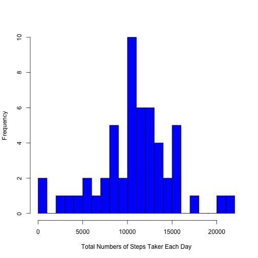
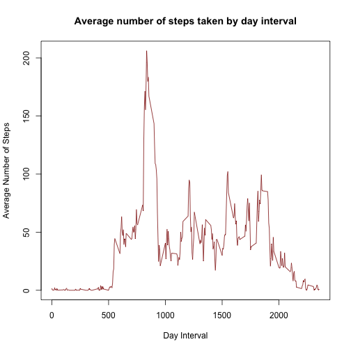
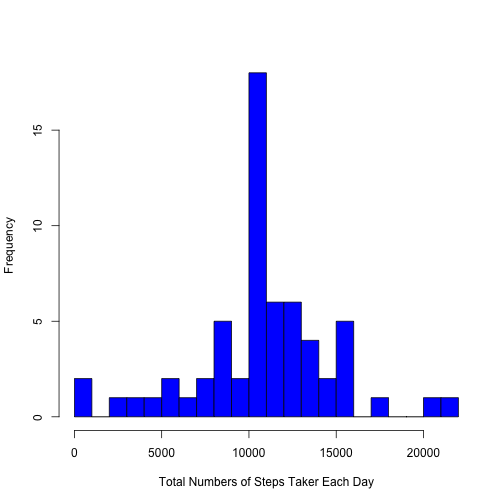
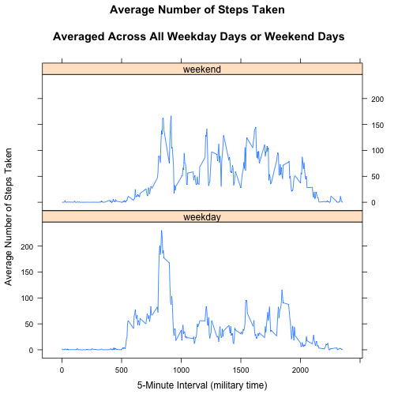

#Reproducible Research: Peer Assessment 1

##Loading and preprocessing the data


```r
library(knitr)
library(dplyr)
data <- read.table(unz("activity.zip", "activity.csv"), header=T, sep=",")

data$date <- as.Date(data$date) 
head(data)
```

```
##   steps       date interval
## 1    NA 2012-10-01        0
## 2    NA 2012-10-01        5
## 3    NA 2012-10-01       10
## 4    NA 2012-10-01       15
## 5    NA 2012-10-01       20
## 6    NA 2012-10-01       25
```

##What is mean total number of steps taken per day?

.Create a new clean dataset ignoring the NA values:


```r
cleandata <- na.omit(data)
stepsgroup <- cleandata %>% group_by(date) %>% summarise(totalsteps = sum(steps))
head(stepsgroup)
```

```
## Source: local data frame [6 x 2]
## 
##         date totalsteps
## 1 2012-10-02        126
## 2 2012-10-03      11352
## 3 2012-10-04      12116
## 4 2012-10-05      13294
## 5 2012-10-06      15420
## 6 2012-10-07      11015
```

.Plot a histogram of total numbers of steps done per day:  


```r
hist(stepsgroup$totalsteps, main ="", xlab ="Total Numbers of Steps Taker Each Day", breaks = 30, col = "blue")
```

 

.Calculate the mean and median steps done per day:


```r
mean(stepsgroup$totalsteps)
```

```
## [1] 10766.19
```

```r
median(stepsgroup$totalsteps)
```

```
## [1] 10765
```

**Observasion**:  
The **mean** number of steps taken per day is **10,766** which is really close to the **median** number of steps **10,765**. 

##What is the average daily activity pattern?
.Calculate average steps for each interval between 24 hours:


```r
intervalgroup <- cleandata %>% group_by(interval) %>% summarise(meansteps = mean(steps, 
    na.rm = TRUE))
head(intervalgroup)
```

```
## Source: local data frame [6 x 2]
## 
##   interval meansteps
## 1        0 1.7169811
## 2        5 0.3396226
## 3       10 0.1320755
## 4       15 0.1509434
## 5       20 0.0754717
## 6       25 2.0943396
```

```r
plot(intervalgroup$interval, intervalgroup$meansteps, xlab = "Day Interval", ylab ="Average Number of Steps", type ="l", col ="dark red", main = "Average number of steps taken by day interval")
```

 

.Report the 5-min interval, on average across all the days in the dataset, contains the maximum number of steps:


```r
intervalgroup[which.max(intervalgroup$meansteps), ]
```

```
## Source: local data frame [1 x 2]
## 
##   interval meansteps
## 1      835  206.1698
```

**Observasion**:  
Based on the plot and the max of meansteps taken perday, it seems that interval **835** is the largest interval of the day with **206** steps.  

##Imputing missing values

.Calculate and report the total number of missing values in the dataset (i.e. the total number of rows with NAs):  


```r
NAcount <- sum(is.na(data$steps))
NAcount
```

```
## [1] 2304
```
*Conclusion*:The dataset has** 2304 NA **values.

.Create a new dataset that is equal to the original dataset but with the missing data filled in:


```r
data2 <- data %>% left_join(intervalgroup, by = "interval" )
data2$fillna <- ifelse(is.na(data2$steps),data2$meansteps, data2$steps)
data2$steps <- NULL
data2$meansteps <- NULL
colnames(data2) <- c("date", "interval", "steps")
data2 <- data2[, c(3, 1, 2)]
head(data2)
```

```
##       steps       date interval
## 1 1.7169811 2012-10-01        0
## 2 0.3396226 2012-10-01        5
## 3 0.1320755 2012-10-01       10
## 4 0.1509434 2012-10-01       15
## 5 0.0754717 2012-10-01       20
## 6 2.0943396 2012-10-01       25
```

*Finally*, **data2** is equal to the original dataset but with the missing data filled in.

.Make a histogram of the total number of steps taken each day:


```r
stepsgroup2 <- data2 %>% group_by(date) %>% summarise(totalsteps = sum(steps))
hist(stepsgroup2$totalsteps, main ="", xlab ="Total Numbers of Steps Taker Each Day", breaks = 30, col = "blue")
```

 

.Calculate and report the mean and median total number of steps taken per day:


```r
meansteps2 <- as.integer(mean(stepsgroup2$totalsteps, na.rm = TRUE))
meansteps2
```

```
## [1] 10766
```


```r
mediansteps2 <- as.integer(median(stepsgroup2$totalsteps, na.rm = TRUE))
mediansteps2
```

```
## [1] 10766
```

**Observation**:  
1.Do these values (mean and median) differ from the estimates from the first part of the assignment?  
Not Really.    
2.What is the impact of imputing missing data on the estimates of the total daily number of steps?  
The histgram of **'Total Numbers of Steps Taker Each Day'** imputing missing data looks no different compared with the former histgram with missing values. In such aspect, imputing missing data value for the data is a good way for analysing data.  

## Are there differences in activity patterns between weekdays and weekends?
For this part the weekdays() function may be of some help here. Use the dataset with the filled-in missing values for this part.  
.Create a new factor variable in the dataset with two levels -- "weekday" and "weekend" indicating whether a given date is a weekday or weekend day:


```r
data2$weektype <- ifelse(weekdays(data2$date) %in% c("Saturday", "Sunday"), "weekend", "weekday")
head(data2)
```

```
##       steps       date interval weektype
## 1 1.7169811 2012-10-01        0  weekday
## 2 0.3396226 2012-10-01        5  weekday
## 3 0.1320755 2012-10-01       10  weekday
## 4 0.1509434 2012-10-01       15  weekday
## 5 0.0754717 2012-10-01       20  weekday
## 6 2.0943396 2012-10-01       25  weekday
```

.Make a panel plot containing a time series plot (i.e. type = “l”) of the 5-minute interval (x-axis) and the average number of steps taken, averaged across all weekday days or weekend days (y-axis):


```r
intervalgroups2 <- data2 %>% group_by(interval, weektype) %>% summarise(meansteps = mean(steps, na.rm = TRUE))
library("lattice")
p <- xyplot( meansteps ~interval | factor(weektype), data= intervalgroups2, 
        type = 'l',
        panel = lattice.getOption("panel.xyplot"),
        main="Average Number of Steps Taken 
        \nAveraged Across All Weekday Days or Weekend Days",
        xlab="5-Minute Interval (military time)",
        ylab="Average Number of Steps Taken",
        layout = c(1,2))
print (p)
```

 

**Observation**:  
Are there differences in activity patterns between weekdays and weekends?  
Yes. The plot indicates that person moves around more (or more active) during the weekend days.
